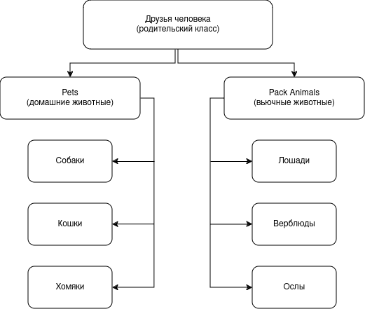

Задание 

Операционные системы и виртуализация (Linux)

1. Использование команды cat в Linux
   - Создать два текстовых файла: "Pets"(Домашние животные) и "Pack animals"(вьючные животные), используя команду `cat` в терминале Linux. В первом файле перечислить собак, кошек и хомяков. Во втором — лошадей, верблюдов и ослов.
   - Объединить содержимое этих двух файлов в один и просмотреть его содержимое.
   - Переименовать получившийся файл в "Human Friends"(.
Пример конечного вывода после команды “ls” :
Desktop Documents Downloads  HumanFriends.txt  Music  PackAnimals.txt  Pets.txt  Pictures  Videos

2. Работа с директориями в Linux
   - Создать новую директорию и переместить туда файл "Human Friends".

3. Работа с MySQL в Linux. “Установить MySQL на вашу вычислительную машину ”
   - Подключить дополнительный репозиторий MySQL и установить один из пакетов из этого репозитория.
   
   
4. Управление deb-пакетами
   - Установить и затем удалить deb-пакет, используя команду `dpkg`.
    
5. История команд в терминале Ubuntu
   - Сохранить и выложить историю ваших терминальных команд в Ubuntu.
В формате: Файла с ФИО, датой сдачи, номером группы(или потока)

<h6>cd /home/gaazoo/Desktop/GeekBrains_Student/Specialization_Final_Work/</h6>
<h6>cat > pets</h6>
<h6>cat > "Pack animals"</h6>
<h6>cat "pets" "Pack animals" > "Human Friends"</h6>
<h6>ls</h6>
<h6>mkdir folder_for_attestation</h6>
<h6>mv 'Human Friends' folder_for_attestation/</h6>
<h6>ls</h6>
<h6>cd folder_for_attestation/</h6>
<h6>ls</h6>
<h6>clear</h6>
<h6>sudo apt-get update</h6>
<h6>clear</h6>
<h6>sudo apt install mysql-server</h6>
<h6>sudo service mysql status</h6>
<h6>clear</h6>
<h6>wget https://mirror.yandex.ru/debian/pool/main/t/tennix/tennix_1.1-3.1_amd64.deb</h6>
<h6>sudo dpkg -i tennix_1.1-3.1_amd64.deb</h6> 
<h6>sudo dpkg -r tennix</h6>
<h6>history</h6>

<h4>Объектно-ориентированное программирование </h4>

6. Диаграмма классов
   - Создать диаграмму классов с родительским классом "Животные", и двумя подклассами: "Pets" и "Pack animals".
В составы классов которых в случае Pets войдут классы: собаки, кошки, хомяки, а в класс Pack animals войдут: Лошади, верблюды и ослы).
Каждый тип животных будет характеризоваться (например, имена, даты рождения, выполняемые команды и т.д)
Диаграмму можно нарисовать в любом редакторе, такими как Lucidchart, Draw.io, Microsoft Visio и других.

7. Работа с MySQL (Задача выполняется в случае успешного выполнения задачи “Работа с MySQL в Linux. “Установить MySQL на вашу машину”
Создаем базу данных Human_friends:

7.1. После создания диаграммы классов в 6 пункте, в 7 пункте база данных "Human Friends" должна быть структурирована в соответствии с этой диаграммой. Например, можно создать таблицы, которые будут соответствовать классам "Pets" и "Pack animals", и в этих таблицах будут поля, которые характеризуют каждый тип животных (например, имена, даты рождения, выполняемые команды и т.д.). 
7.2   - В ранее подключенном MySQL создать базу данных с названием "Human Friends".
   - Создать таблицы, соответствующие иерархии из вашей диаграммы классов.
   <h6>mysql> USE Human_friends;</h6>
Database changed
mysql> CREATE TABLE Родительский_класс (
    ->   id INT PRIMARY KEY AUTO_INCREMENT,
    ->   тип VARCHAR(50)
    -> );
Query OK, 0 rows affected (0,05 sec)

mysql> CREATE TABLE pets (
    ->   id INT PRIMARY KEY,
    ->   вид VARCHAR(50),
    ->   FOREIGN KEY (id) REFERENCES Родительский_класс(id)
    -> );
Query OK, 0 rows affected (0,05 sec)

mysql> CREATE TABLE Собаки (
    ->   id INT PRIMARY KEY,
    ->   имя VARCHAR(50),
    ->   команда VARCHAR(50),
    ->   дата_рождения DATE,
    ->   FOREIGN KEY (id) REFERENCES pets(id)
    -> );
Query OK, 0 rows affected (0,05 sec)

mysql> CREATE TABLE Кошки (
    ->   id INT PRIMARY KEY,
    ->   имя VARCHAR(50),
    ->   команда VARCHAR(50),
    ->   дата_рождения DATE,
    ->   FOREIGN KEY (id) REFERENCES pets(id)
    -> );
Query OK, 0 rows affected (0,06 sec)

mysql> CREATE TABLE Хомяки (
    ->   id INT PRIMARY KEY,
    ->   имя VARCHAR(50),
    ->   команда VARCHAR(50),
    ->   дата_рождения DATE,
    ->   FOREIGN KEY (id) REFERENCES pets(id)
    -> );
Query OK, 0 rows affected (0,06 sec)

mysql> CREATE TABLE Pack_animals (
    ->   id INT PRIMARY KEY,
    ->   вид VARCHAR(50),
    ->   FOREIGN KEY (id) REFERENCES Родительский_класс(id)
    -> );
Query OK, 0 rows affected (0,06 sec)

mysql> CREATE TABLE Лошади (
    ->   id INT PRIMARY KEY,
    ->   имя VARCHAR(50),
    ->   команда VARCHAR(50),
    ->   дата_рождения DATE,
    ->   FOREIGN KEY (id) REFERENCES Pack_animals(id)
    -> );
Query OK, 0 rows affected (0,06 sec)

mysql> CREATE TABLE Верблюды (
    ->   id INT PRIMARY KEY,
    ->   имя VARCHAR(50),
    ->   команда VARCHAR(50),
    ->   дата_рождения DATE,
    ->   FOREIGN KEY (id) REFERENCES Pack_animals(id)
    -> );
Query OK, 0 rows affected (0,06 sec)

mysql> CREATE TABLE Ослы (
    ->   id INT PRIMARY KEY,
    ->   имя VARCHAR(50),
    ->   команда VARCHAR(50),
    ->   дата_рождения DATE,
    ->   FOREIGN KEY (id) REFERENCES Pack_animals(id)
    -> );
Query OK, 0 rows affected (0,06 sec)</h6>

Готовые таблицы

<h6></h6>
   - Заполнить таблицы данными о животных, их командах и датами рождения.

INSERT INTO Верблюды (id, имя, команда, дата_рождения)
VALUES (1, 'Олег', 'Пошел', '2020-09-03'),
(2, 'Владлен', 'Стоять' '2020-13-22'),
(3, 'Горбун', "Сидеть' '2021-11-11');

INSERT INTO Кошки ( имя, команда, дата_рождения)
VALUES ('Барсик', 'Жрать', '2022-02-22'),
('Рыжик', 'Играть','2022-10-08');
INSERT INTO Лошади ( имя, команда, дата_рождения)
VALUES ('Конь', 'Вперед', '2021-01-31'),
       ('Ветерок', 'Стой', '2020-03-03');
INSERT INTO Ослы ( имя, команда, дата_рождения)
VALUES ('Алеша', 'Бегом', '2018-05-21'),
       ('Валера', 'Стоять', '2021-01-01');
INSERT INTO Собаки ( имя, команда, дата_рождения)
VALUES ('Тузик', 'Апорт', '2019-09-09),
       ('Джек', 'Лежать', '2020-12-12');
INSERT INTO Хомяки ( имя, команда, дата_рождения)
VALUES ('Петя', 'Спать', '2022-02-02'),
       ('Вася', 'Играть', '2023-03-03');

   - Удалить записи о верблюдах и объединить таблицы лошадей и ослов.
   - Создать новую таблицу для животных в возрасте от 1 до 3 лет и вычислить их возраст с точностью до месяца.
   - Объединить все созданные таблицы в одну, сохраняя информацию о принадлежности к исходным таблицам.
